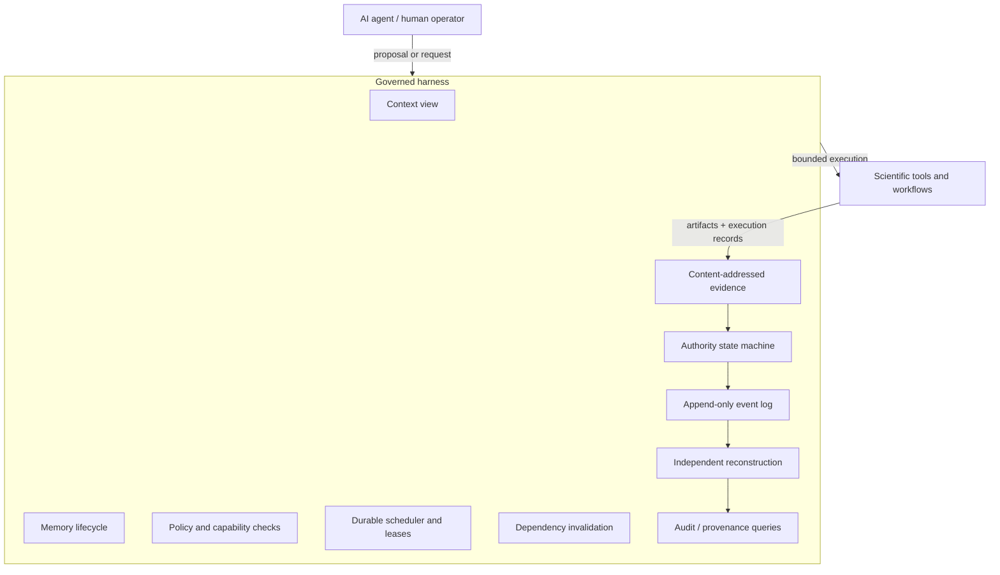

# Scientific AI Harness

## A governed, replayable execution and evidence substrate for long-horizon scientific agents

**Status:** architecture and software white paper  
**Repository:** `cakeisalie89/Quantum-Thermal-`  
**Reference implementation:** `qta_agent/` on the scientific-agent branch  
**Scientific case study:** Quantum Thermal Architecture (QTA)  
**Scientific claim boundary:** MODEL_ONLY / FORECAST_ONLY / PRE-EXPERIMENTAL; `PASS = 0`

---

## Abstract

Modern AI agents can generate code, invoke numerical software, retain memory, modify assumptions, coordinate with other agents, and operate over long sequences of actions. None of those capabilities establishes that the resulting scientific state is trustworthy. Model context is transient. Agent-reported state is self-authored. Evidence can become stale when upstream assumptions change. A process that both produces a result and certifies that result collapses the distinction between computation and verification. Long-running automation adds further failure modes: interrupted execution, stale leases, hidden retries, policy drift, environmental nondeterminism, partial writes, forged replay events, and state that cannot be independently reconstructed after the process that created it has disappeared.

This paper presents a **Scientific AI Harness**: an external execution, authority, memory, evidence, and verification substrate intended to keep long-horizon scientific automation reconstructible and challengeable. The central design decision is that the model is **not the system of record**. Durable history is recorded as an append-only, hash-chained event log. Current state is a projection reconstructed from that history. Scientific evidence is content-addressed. Memory and context are structurally separate from evidence and authority. Proposal, execution, verification, and promotion are separate operations. Side effects occur through explicit capabilities and policy rather than ambient privilege. A second implementation independently reconstructs governed state so that the primary reader is not the only component capable of judging its own history.

The harness also treats the verification machinery itself as an adversarial target. Property-based testing, mutation testing, hostile replay, fuzzing, crash recovery, long-horizon campaigns, differential reconstruction, and hosted cross-environment execution are used to ask not merely whether code was exercised, but whether the system would detect the removal or weakening of specific enforcement points.

The architecture grew out of a demanding cryogenic multiphysics project, QTA. That project remains a forecast-only scientific case study with zero physical `PASS` gates. QTA is therefore used here as a stress workload for provenance, reproducibility, invalidation, and authority separation; it is **not** presented as experimentally validated hardware, a digital twin, a proof of physical feasibility, or evidence that the harness can establish scientific truth by itself.

The contribution of this work is the systems architecture and its failure model: a scientific agent may reason, propose, execute, remember, and coordinate, while authoritative state remains outside the agent and must survive independent reconstruction.

---

## 1. The problem is not simply better reasoning

A scientific agent can be highly capable and still produce an untrustworthy process.

Consider a long-running agent that:

1. proposes a parameter change;
2. edits a numerical model;
3. executes the model;
4. stores the result;
5. summarizes the result into memory;
6. later changes an upstream assumption;
7. continues working from a compressed context;
8. tells a second agent that the prior result is still valid;
9. verifies its own output;
10. promotes that output into the next stage of work.

Even if every individual model response appears reasonable, several questions remain unanswered:

- What exactly is canonical now?
- Which event made it canonical?
- What evidence supported that transition?
- Did the cited bytes actually exist and hash to the claimed digest?
- Did a later dependency change invalidate the conclusion?
- Did the same identity both produce and certify the result?
- Did an interrupted process leave the system between states?
- Can a fresh process reconstruct the same state without trusting the original agent?
- Can a verifier disagree with the primary implementation, or does it merely call the same code again?
- Did the same computation actually run on another machine, or did a test accidentally compare regenerated output with itself?
- Did a green test suite prove that a safety guard mattered, or merely that the guarded path happened to execute?

These are not primarily questions about language-model intelligence. They are questions about **authority, state, evidence, execution, identity, and reconstruction**.

The Scientific AI Harness is designed around that distinction.

---

## 2. Core thesis

> **A scientific agent should be allowed to influence authoritative state, but should not itself be authoritative merely because it produced a plausible account of what happened.**

The harness therefore moves the system of record outside the model. The model can request actions and generate candidate artifacts, but canonical state is derived from durable records governed by explicit transition rules.

Three consequences follow.

First, **context is not state**. A context window is a temporary view presented to an agent. It may be compacted, reordered, summarized, or lost. Losing it must not erase the history required to reconstruct the system.

Second, **memory is not evidence**. A remembered statement may influence future reasoning, but it does not become scientifically authoritative because it was remembered. Memory has its own lifecycle and can be superseded or retracted without rewriting the evidence store.

Third, **reproducibility is not correctness**. Re-running a tool and obtaining the same bytes can establish an important execution property. It cannot establish that the model equations describe reality, that the assumptions are valid, or that a scientific claim is experimentally true.

---

## 3. Threat model

The harness assumes a powerful but fallible automation environment. Failures may be accidental, emergent, environmental, or adversarial. The design does not require the language model itself to be malicious.

### 3.1 Self-authored state

An event may claim that a transition began from a particular state, that a named actor performed an action, or that a verification occurred. If replay trusts those payload fields, the event can choose the authority context in which it is judged.

The harness instead reconstructs the prior state from history and judges the new event against that reconstructed state.

### 3.2 Self-certification

If the same identity can propose, execute, verify, and promote an artifact, verification becomes another form of assertion. Role separation therefore exists at the authority layer rather than as a convention in a prompt.

### 3.3 Stale conclusions

A result may have been valid relative to an earlier input graph and become stale when an assumption, policy, parameter, artifact, or dependency changes. The system must represent invalidation explicitly rather than relying on the agent to remember which conclusions should be revisited.

### 3.4 Replay forgery and projection corruption

The live projection may be wrong even when the durable history is intact. A second implementation is therefore used to reconstruct governed state independently and report disagreements or malformed histories.

### 3.5 Vacuous verification

A verification process can appear green while checking nothing. Examples include a byte-comparison step that compares zero artifacts, a mutation campaign that starts from an already-failing baseline, or a test that passes because the relevant workflow stage never ran.

The verification harness treats anti-vacuity conditions as first-class requirements.

### 3.6 Environment-dependent execution

Scientific numerics can differ at the byte level across CPU instruction sets, BLAS dispatch paths, library builds, thread counts, operating systems, filesystem behavior, and network stacks. A deterministic local result does not imply cross-environment byte identity.

The harness therefore distinguishes **determinism conditional on an execution environment** from **portable numerical equivalence**.

### 3.7 Side effects and ambient privilege

A long-running agent may gain accidental authority simply because the process can write arbitrary paths, read arbitrary files, reach arbitrary network destinations, or access raw secret values. The harness makes these operations explicit, bounded, and auditable.

### 3.8 Collusion and external identity limits

Software can compare identities and roles; it cannot prove that nominally separate identities are controlled by genuinely independent principals. Several colluding accounts can therefore defeat some separation-of-duties assumptions unless an external identity authority exists.

This boundary is explicit. The architecture aims to make such failures visible and bounded, not to claim that software alone can prove human or organizational independence.

---

## 4. Architecture

The harness separates cognition from authority and scientific execution.



The architecture is deliberately layered. The scientific workload is not the authority layer, and the authority layer is not the scientific model.

### 4.1 Durable history

`qta_agent/events.py` implements the append-only, hash-chained event history. The event log is the durable authority record. Other views are derived from it.

A lost in-memory projection should therefore cost time, not authority: the projection can be rebuilt by replay.

### 4.2 Canonical representation

`qta_agent/canonical.py` defines a canonical byte representation so that the same logical record maps to one digest. This is foundational for content-addressed evidence and tamper detection.

### 4.3 Live projection

`qta_agent/store.py` maintains the current view of governed state. It is transactional through the log rather than an independent truth source.

### 4.4 Authority transitions

`qta_agent/authority.py` defines explicit state transitions. The design uses enumerated transitions rather than allowing arbitrary state mutation. Important invariants include:

| Invariant | Meaning |
|---|---|
| Promotion requires verification | A proposed record cannot become canonical merely because it exists. |
| Revoked/rejected authority is terminal | Withdrawn authority is not silently resurrected; recovery requires a new record. |
| Stale state cannot jump directly back to promoted | Changed dependencies require renewed verification. |
| Proposer and verifier must differ | Self-verification is refused at the authority layer. |
| Policy does not retroactively self-authorize | A later policy change cannot rewrite the legitimacy of an earlier decision. |
| Required evidence must resolve | A syntactically valid digest is insufficient if no matching bytes exist. |

### 4.5 Evidence store

`qta_agent/evidence.py` stores evidence by content digest. The digest is a name for bytes, not proof by itself. Reads re-hash the content rather than trusting the filesystem path.

This closes an important class of failure: citing a well-formed but nonexistent digest.

### 4.6 Dependency invalidation

`qta_agent/invalidation.py` propagates the consequences of changed inputs. This allows the system to mark derived authority stale rather than relying on a model or operator to remember every downstream dependency.

---

## 5. Memory, context, evidence, and authority are different objects

Many agent systems collapse several distinct concepts into a single store. The harness keeps them separate because their trust semantics are different.

### 5.1 Context

`qta_agent/context.py` records what an agent was shown. Context is a view, not a claim about reality. It can be useful for reproducing an agent decision without granting the displayed material authority.

### 5.2 Memory

`qta_agent/memory.py` represents durable memory as lifecycle-governed state reconstructed from history. A memory object is identified independently of the model context that happens to mention it.

Memory can influence future context, but memory is not evidence. A remembered conclusion does not become canonical merely because it persists.

Retraction is treated as a meaningful lifecycle event. Replay must not allow a later forged event to resurrect a terminally retracted memory object by trusting the state named in the event payload.

### 5.3 Evidence

Evidence is byte-addressed material that can be resolved and checked. It is not a natural-language recollection of what the agent thinks an artifact contained.

### 5.4 Authority

Authority answers whether a record is currently canonical under the transition rules and available evidence. It is therefore a property of governed history, not of confidence language in an agent response.

This separation is central to long-horizon operation. A model may lose or compact its context while the system still retains the complete history needed to rebuild memory, evidence references, and authority state.

---

## 6. Durable work and long-horizon execution

A long-running scientific system needs more than a task list inside a model context.

### 6.1 Tasks and scheduler

`qta_agent/tasks.py` and `qta_agent/scheduler.py` implement durable task state, readiness, leases, retries, cancellation, and recovery. Ownership is recorded rather than inferred from whichever process happens to be alive.

Leases matter because process death is normal in long-horizon systems. A restarted supervisor must be able to distinguish work that is still legitimately owned from work whose execution authority has expired.

### 6.2 Host identity

`qta_agent/hostid.py` strengthens lease identity beyond a bare process ID by incorporating host/boot/process lifetime information. This reduces the risk of confusing a recycled PID with the process that originally held authority.

### 6.3 Idempotency

`qta_agent/idempotency.py` gives durable identity to requests. Idempotency keys are scoped rather than globally magical strings, reducing the risk that guessing or reusing a key reaches unrelated work.

### 6.4 Crash recovery

The event log, scheduler, and projection are tested under interrupted and restarted execution. Recovery is derived from recorded history rather than from assumptions about what a dead process probably completed.

---

## 7. Governing side effects

An agent that can reason safely but write anywhere, read anything, or contact arbitrary hosts is not governed in practice.

### 7.1 Filesystem reads and writes

`qta_agent/safeio.py` and `qta_agent/readpath.py` mediate filesystem access. The design uses confined, capability-checked access and records attempts. Governed production paths use explicit output boundaries rather than allowing an agent or subprocess to choose arbitrary destinations.

### 7.2 Capabilities

`qta_agent/capability.py` represents authority as a bounded object rather than an ambient Boolean. A capability can express who may perform which operation over which resource and for how long.

### 7.3 Tool contracts

`qta_agent/tools.py` defines registered tool contracts with default-deny behavior. A tool does not become trusted merely because an agent knows its name.

### 7.4 Network authority

`qta_agent/netauth.py` treats egress as an explicit grant. Network access is default-deny and host/address handling is part of the policy boundary.

This area is especially sensitive to environmental assumptions. A rule that passes on an IPv4-only development environment can fail differently on a dual-stack hosted runner. The harness therefore uses hosted execution as an adversarial environment, not just as a deployment convenience.

### 7.5 Secrets

`qta_agent/secrets.py` is designed around scoped references: references may travel through the system while raw secret values are kept at the narrowest possible surface. Redaction and lifetime/revocation semantics are part of the interface rather than prompt instructions.

---

## 8. Independent reconstruction

A verifier that calls the same reducer, imports the same transition table, or invokes the same function it is supposed to second-guess is not independent in the useful sense.

`qta_agent/reconstruct.py` therefore implements a second reading of governed history. Its job is not merely to recompute the same projection but to restate critical acceptance rules independently enough to expose disagreements.

`qta_agent/separate_verify.py` runs the second reading in a separate process and enforces import restrictions for components whose behavior it is intended to challenge.

This creates a useful distinction:

- **primary enforcement** should refuse an invalid event before it becomes a durable fact;
- **independent reconstruction** should still detect malformed or forged history that bypassed the primary write path.

The second reader is a detector, not a substitute for the first reader being correct.

The project has already found defects where this distinction mattered. In one class, the independent reader reproduced a production rule by calling the very authority logic it existed to challenge. In another, multiple readers agreed because they all trusted the same forged identity field. These failures motivate a stronger rule: independence must be evaluated at the level of **assumptions and accepted language**, not merely at the level of separate files or processes.

---

## 9. Verification of the verification machinery

Traditional coverage is insufficient for this architecture. A line can execute while contributing nothing to safety.

The harness therefore asks a stronger question:

> If a specific guard, admission rule, or invariant were weakened or deleted, would the verification system notice?

### 9.1 Mutation testing

Mutation specifications remove or weaken enforcement points. A mutation is considered useful only when it represents a meaningful violation and the relevant tests fail for that reason.

The mutation harness itself is guarded against false confidence. It refuses to start from an already-red baseline, refuses silently stale mutation anchors, and checks restoration after mutation. A surviving mutation is evidence that a claimed enforcement point is not currently protected by the test suite.

### 9.2 Property-based and fuzz testing

Property-based tests exercise invariants across generated state transitions and malformed inputs. Fuzzing targets parsers, capability boundaries, network authority, replay, and other surfaces where hand-selected examples are unlikely to cover the state space.

### 9.3 Differential reconstruction

The live projection and independent reader are compared, while malformed histories are also tested directly against the second reader so that primary refusal does not prevent independent inspection.

### 9.4 Long-horizon campaigns

Long campaigns execute many sequential operations to expose state growth, stale leases, replay cost, hidden O(N²) behavior, liveness failures, and invariants that hold for short tests but decay over time.

### 9.5 Hosted environment contradiction

Hosted CI is treated as evidence about a specific commit and environment, not as a ceremonial green badge. The project has recorded cases where hosted runners contradicted local closure because the environment exposed assumptions about network addressing, CPU dispatch, and workflow ordering.

A green run therefore belongs to the commit that produced it. It is not inherited by later commits.

---

## 10. Commit-scoped truth and defect accounting

The project distinguishes three ideas that are often collapsed into the word *complete*:

| State | Meaning |
|---|---|
| `GATE_SATISFIED_AT_COMMIT` | Every stated condition of a named engineering gate was satisfied at a particular commit on the evidence available then. This is historical. |
| `CURRENTLY_OPEN_FINDING` | A defect of that class is presently known. The finding reopens the work prospectively without rewriting the historical record. |
| `CURRENTLY_CLOSED` | No open finding remains and the evidence required by the finding has been re-run for the current state. |

This distinction matters because a completion matrix and a defect ledger answer different questions.

The matrix asks whether a requirement has been implemented to its currently stated technical boundary. The defect ledger asks whether a concrete failure is known now. A requirement can have been defensibly closed at one commit and later be reopened by hostile review without falsifying the historical fact that the earlier gate conditions were satisfied at that earlier commit.

The repository therefore keeps repaired defects rather than deleting embarrassing history. The aim is to preserve the sequence of discovered failure modes so that the same class does not survive in another representation.

---

## 11. Scientific execution underneath the harness

The harness is not a numerical method. It governs numerical work.

Scientific tools may include numerical solvers, workflow engines, sensitivity analysis, optimization, data containers, provenance metadata, visualization, and independent benchmark implementations. The important architectural property is that these tools sit behind explicit contracts and produce evidence that can be named, reproduced, invalidated, and audited.

In this repository, the scientific side includes the QTA multiphysics code, HDF5 scientific outputs, workflow orchestration, deterministic package checks, provenance metadata, and reproducibility machinery. Those components remain scientifically domain-specific.

The harness is intended to remain conceptually separable from them:

```text
agent cognition / planning
          |
          v
governed state + authority + evidence + execution
          |
          v
scientific workflows / solvers / data products
```

This separation is what allows the same authority model to govern a different scientific workload without importing cryogenic physics into the definition of the harness.

---

## 12. QTA as the originating stress case

The Quantum Thermal Architecture project is the workload that exposed the need for this architecture.

QTA is a forecast-only, mode-separated cryogenic multiphysics framework. Its scientific package contains explicit evidence states, validation gates, numerical checks, provenance, reproducibility machinery, and strict non-claims. It currently reports zero physical `PASS` gates and does not claim validated hardware.

The scientific application is useful as a harness stress case because it contains exactly the conditions that make agent self-report dangerous:

- many coupled assumptions;
- domain-specific evidence classes;
- mutually exclusive operating modes;
- blocked measurements;
- numerical outputs that can be internally self-consistent without being experimentally validated;
- dependencies whose changes should invalidate downstream conclusions;
- reproducibility requirements that can be confused with scientific correctness;
- long-running analysis where human and agent decisions need durable provenance.

The harness was therefore not created to prove QTA correct. It was created because QTA made a broader systems failure obvious: a long-running computational process needs an authority layer outside itself.

### 12.1 Case-study boundary

The QTA workload remains subject to its own scientific claim boundary:

- no validated hardware;
- no claim of simultaneous processing and sensing;
- no claim that forecast outputs are measured results;
- no digital-twin claim;
- no external-solver equivalence claim unless separately demonstrated;
- no `PASS` without the evidence required by the scientific gate.

The harness must not be allowed to weaken those boundaries. In the current architecture, harness verification has `automatic_gate_effect = NONE`: software provenance and reproducibility do not automatically advance the scientific state.

---

## 13. A representative governed workflow

A governed production path can be summarized as:

1. A task is created with a durable identity.
2. Policy and capability checks determine whether the requested operation is admissible.
3. The scheduler places ready work into a durable queue.
4. A worker receives a bounded lease.
5. The declared tool executes under bounded process and I/O rules.
6. Output bytes are placed into the content-addressed evidence store.
7. Completion is recorded in the event history.
8. A separately identified verifier receives its own bounded authority.
9. For a byte-identical contract, verification re-runs the tool rather than trusting the first execution record.
10. The independent reader reconstructs the resulting authority history.
11. Audit queries can answer who did what, under which policy, using which evidence.
12. Promotion or acceptance occurs only if the explicit authority transition is legal.

The important property is not that every task must use byte identity. Different scientific workloads may require different verification contracts. The important property is that the contract is explicit and that verification is not inferred from the producing agent's narrative.

---

## 14. What the harness can establish

Within its implemented boundary, the harness is designed to establish facts such as:

- a declared tool was the tool invoked;
- execution occurred under a recorded task and authority context;
- the produced artifact hashes to the digest stored in evidence;
- a verifier distinct from the proposer/executor performed the declared verification step;
- a durable event history can be replayed into the same governed state;
- a changed dependency invalidated downstream authority according to declared rules;
- a memory lifecycle transition occurred and replay preserves it;
- an attempted read, write, or network action was allowed or refused by the governing policy;
- a specific commit had a specific verification result in a specific execution environment.

These are strong and useful statements. They are deliberately narrower than scientific truth.

---

## 15. What the harness does not establish

The harness does **not** claim to establish any of the following by itself:

- that a scientific model describes reality;
- that an assumption is physically correct;
- that a reproducible result is scientifically correct;
- that byte-identical output is numerically superior to a non-identical but equivalent output;
- that nominally separate identities are controlled by genuinely independent humans or organizations;
- that mediation inside one process is equivalent to complete operating-system or network isolation;
- that a model cannot reason incorrectly;
- that all future bugs have been eliminated;
- that passing tests constitute experimental validation;
- AGI, recursive self-improvement, autonomous scientific truth, or infallibility.

The design goal is narrower and more testable: **make authority explicit, reconstructible, and difficult to fake silently.**

---

## 16. Determinism and the scientific-computing boundary

The project originally treated byte-identical regeneration as a strong release property. Cross-environment work exposed an important limitation: low-level numerical libraries may dispatch different kernels on different CPUs while solving the same mathematical problem to comparable numerical accuracy.

That leads to a necessary distinction.

### 16.1 Release determinism

Within a pinned and compatible execution environment, byte-identical regeneration is a powerful integrity check. It can expose unexpected drift in parameters, code paths, serialization, or dependencies.

### 16.2 Cross-environment numerical equivalence

Across heterogeneous hardware, strict byte identity may be impossible or undesirable. Different BLAS or element-wise CPU dispatch paths can produce floating-point differences without changing the scientific interpretation.

The harness should therefore treat the verification contract as a declared property of the workload rather than assuming that one notion of determinism fits every scientific result.

This is also why execution provenance matters: without knowing the environment, a byte-level disagreement can be misdiagnosed as scientific drift when it is actually a hardware-dependent numerical path.

---

## 17. Design principles

The implementation can be summarized by ten principles.

1. **The model is not the system of record.**
2. **The log is durable authority history; projections are rebuildable views.**
3. **An event does not get to choose the state or identity context in which it is judged.**
4. **Memory, context, evidence, and authority are separate data types with separate trust semantics.**
5. **Proposal, execution, verification, and acceptance are different operations.**
6. **Side effects require explicit authority rather than ambient process privilege.**
7. **Evidence is bound to bytes, not merely to names or natural-language descriptions.**
8. **Changed dependencies must have explicit consequences.**
9. **The verifier is itself an attack surface and must be mutation-tested and independently reconstructed.**
10. **Every claim about a green run is scoped to the commit and environment that produced it.**

---

## 18. Evaluation strategy

A serious evaluation of this architecture should not ask only whether unit tests pass. It should attempt to violate the invariants directly.

### 18.1 State-forgery tests

- append events whose payload lies about the prior state;
- attempt to resurrect terminal states;
- omit required predecessor events;
- reorder histories;
- corrupt hashes;
- supply evidence digests that do not resolve.

### 18.2 Identity and role tests

- proposer attempts to verify own record;
- worker reports another worker's lease;
- event payload names an executor that never executed;
- verifier identity is forged in payload;
- multiple nominal identities collude.

### 18.3 Liveness and recovery tests

- process dies after lease but before completion;
- process dies during artifact write;
- supervisor restarts repeatedly;
- retry budget is exhausted by crashes rather than normal failures;
- replay begins from a checkpoint and from the beginning and must agree.

### 18.4 Side-effect tests

- path traversal and symlink attacks;
- undeclared reads;
- writes outside governed output roots;
- network destination changes after resolution;
- IPv4/IPv6 disagreement;
- secret leakage through logs, exceptions, or context.

### 18.5 Anti-vacuity tests

- verification over zero artifacts;
- mutation testing from a failing baseline;
- tests that skip because the environment lacks a feature;
- a workflow stage that silently never runs;
- a second reader that imports or calls the primary enforcement rule.

### 18.6 Long-horizon tests

- thousands of events;
- large dependency graphs;
- repeated invalidation and re-verification;
- many task lease/retry cycles;
- context compaction while durable state remains reconstructible;
- performance guards for replay, scheduling, and audit queries.

The system should be considered stronger when hostile tests expose new defects, not weaker merely because the defect ledger grows. A retained defect history is evidence that the architecture is being challenged rather than polished into a perfect retrospective narrative.

---

## 19. Current implementation map

The current reference implementation is organized approximately as follows:

| Concern | Primary implementation |
|---|---|
| Canonical bytes | `qta_agent/canonical.py` |
| Safe confined I/O | `qta_agent/safeio.py`, `qta_agent/readpath.py` |
| Durable event history | `qta_agent/events.py` |
| Authority transitions | `qta_agent/authority.py` |
| Evidence | `qta_agent/evidence.py` |
| Capabilities | `qta_agent/capability.py` |
| Idempotency | `qta_agent/idempotency.py` |
| Tool registry / contracts | `qta_agent/tools.py` |
| Execution | `qta_agent/execution.py` |
| Policy | `qta_agent/policy.py` |
| Secret references | `qta_agent/secrets.py` |
| Network authority | `qta_agent/netauth.py` |
| Live projection | `qta_agent/store.py` |
| Dependency invalidation | `qta_agent/invalidation.py` |
| Independent reconstruction | `qta_agent/reconstruct.py` |
| Separate verifier process | `qta_agent/separate_verify.py` |
| Durable tasks | `qta_agent/tasks.py` |
| Scheduler / leases / retry | `qta_agent/scheduler.py` |
| Memory | `qta_agent/memory.py` |
| Context | `qta_agent/context.py` |
| Multi-agent roles | `qta_agent/agents.py` |
| Audit | `qta_agent/audit.py`, `tools/audit_log.py` |
| Governed production workflow | `qta_agent/governed_stage10.py` |
| Completion accounting | `docs/completion_matrix.json` |
| Defect accounting | `docs/DEFECT_LEDGER.md` |
| Mutation testing | `tools/mutation_matrix.py`, `tools/mutations/` |
| Long-horizon / hostile tests | `tests/test_agent_long_horizon.py`, `tests/test_agent_hostile_campaign.py` and related suites |

This table is an implementation map, not a claim that every possible trust problem is solved.

---

## 20. Relationship to deterministic simulation and testing systems

Deterministic simulation, fuzzing, and systematic schedule exploration address a closely related but distinct layer of the problem.

A deterministic execution system asks questions such as:

- can this program execution be reproduced?
- can scheduling or timing choices be systematically explored?
- can rare failures be made replayable?

The Scientific AI Harness additionally asks:

- what did the agent believe at this point, and what was merely in context?
- which claim was canonical?
- who had authority to change it?
- what evidence supported it?
- what became stale after an upstream change?
- did the verifier have a genuinely separate decision path?
- can the authoritative state be reconstructed after the original agent process is gone?

These approaches are complementary. Deterministic execution can strengthen the scientific-worker layer; event-sourced authority and evidence governance address the higher-level history that spans many executions.

---

## 21. Why this is a harness rather than a model feature

The architecture is intentionally external to the language model.

If durable state, evidence validity, role separation, and side-effect authority exist only as instructions inside a model context, then the same component being governed is also responsible for remembering and obeying the rules that govern it.

A harness changes the trust relationship:

- the model proposes;
- deterministic code records and checks;
- bounded tools execute;
- evidence is stored independently;
- a separate actor verifies;
- replay reconstructs;
- policy decides what transitions are legal;
- audit can disagree with the model's narrative.

This does not make the model unimportant. It makes model intelligence **orthogonal to authority**.

That separation is the central design objective.

---

## 22. Future work

The next stages should focus less on adding named technologies and more on strengthening invariants across boundaries.

Priority areas include:

- stronger external identity and attestation options for real separation of principals;
- more formally specified transition systems and model checking of reachable authority states;
- systematic deterministic-execution backends for worker processes where applicable;
- richer scientific verification contracts beyond byte identity;
- cross-machine numerical-equivalence policies for heterogeneous scientific hardware;
- provenance-aware context compaction so summaries retain traceable source links without becoming authority;
- larger multi-agent conflict and collusion campaigns;
- long-duration fault injection across scheduler, evidence, policy, network, and storage layers;
- performance envelopes for very large histories and dependency graphs;
- migration/versioning rules for event schemas without weakening historical replay;
- independent implementations of additional critical readers so that agreement is not produced by shared assumptions.

The architectural rule for future work should remain the same: a subsystem is not added because it sounds complete; it is added because a concrete failure mode requires an explicit boundary.

---

## 23. Conclusion

The core problem addressed by this work is not whether an AI agent can generate scientific code or maintain a long conversation. It is whether a long-running scientific process can remain reconstructible when the agent forgets, restarts, changes assumptions, produces stale evidence, encounters a different machine, or reports a state that the durable history does not support.

The Scientific AI Harness answers by making authority external to the model. History is durable. State is replayed. Memory is governed but non-authoritative. Evidence resolves to bytes. Dependencies can invalidate conclusions. Side effects require capabilities. Proposal and verification are separated. A second implementation can challenge the first. The verification layer is itself subjected to mutation, fuzzing, hostile replay, crash recovery, and cross-environment contradiction.

The intended result is not an autonomous truth machine. It is a system in which scientific automation can be powerful without being allowed to silently define its own reality.

QTA remains the originating scientific stress case and remains forecast-only. The broader contribution is the harness surrounding it: a governed execution and evidence substrate designed so that long-horizon scientific agents can act without becoming their own final authority.

---

## Appendix A — Reading order for reviewers

For reviewers evaluating the implementation rather than this paper, a useful order is:

1. `AGENT_SUBSTRATE.md` — architecture and invariants.
2. `docs/DEFECT_LEDGER.md` — failures that were actually found and how claims changed.
3. `qta_agent/authority.py` — authority transitions.
4. `qta_agent/events.py` — durable history.
5. `qta_agent/store.py` — primary projection.
6. `qta_agent/reconstruct.py` — independent reconstruction.
7. `qta_agent/memory.py` and `qta_agent/context.py` — separation of remembered/viewed information from evidence.
8. `qta_agent/scheduler.py` and `qta_agent/tasks.py` — long-running work.
9. `qta_agent/netauth.py`, `qta_agent/secrets.py`, `qta_agent/readpath.py` — side-effect authority.
10. `qta_agent/governed_stage10.py` — production integration.
11. `tools/mutation_matrix.py` and `tools/mutations/` — enforcement-point testing.
12. `tests/test_agent_hostile_campaign.py`, `tests/test_agent_long_horizon.py`, and the related agent suites — adversarial behavior.
13. `docs/completion_matrix.json` — requirement accounting.
14. QTA scientific documentation — case-study physics and its independent scientific claim boundary.

## Appendix B — Snapshot discipline

This paper intentionally avoids treating a branch-level statement such as “complete” or “green” as timeless.

Run-specific evidence should be read from the commit-scoped CI record and `docs/DEFECT_LEDGER.md`. Requirement closure should be read from `docs/completion_matrix.json`. Scientific gate status should be read from the QTA scientific source of truth.

The categories must remain separate:

- **software requirement closure** is not absence of defects;
- **absence of currently known defects** is not proof of correctness;
- **reproducible execution** is not scientific validation;
- **scientific validation** is not created by the harness automatically.

That separation is part of the architecture, not a documentation convention.
